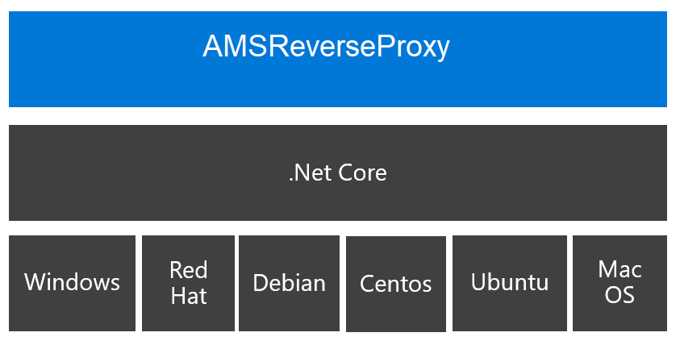

# What is AMSReverseProxy?
Azure Media Services Reverse Proxy is a reverse proxy which is used to convert dynamically TTML subtitles (text only) associated with a Smooth Streaming content (VOD or Live) into WebVTT subtitles associated with a HLS content (VOD or Live).
This component is based on the following asusmptions:
- the streams are coming from Azure Media Services
- The url associated with the Smooth Streaming content will end with '.ism/manifest'
- whereas the url associated with the HLS content will end with '.ism/manifest(format=m3u8-aapl)'

The conversion of TTML subtitles into WebVTT subtitles can be launched:
- when the Reverse Proxy starts, in that case the list of Smooth Streaming content with TTML stracks to take into account is defined in the service configuration files
- when the Reverse Proxy receives a request to open either an Smooth Streaming manifest (.ism/manifest) or a HLS Playlist (.ism/manifest(format=m3u8-aapl)). In that case, the component will check whether the Smooth Streaming content contains at least a TTML track, if it's the case the TTML conversion will be launched for this stream.

When all the TTML Subtitles for a Smooth Streaming VOD asset are converted or when a sufficient number of TTML Subtitles (configurable number - Subtitle conversion depth) for a Smooth Streaming Live asset, the default HLS Playlists returned by Azure Media Serivces will be updated on the fly to add the WebVTT tracks.

The latest releases are available [here](https://github.com/flecoqui/AMSReverseProxy/tree/master/Releases)

- [Windows latest release](https://github.com/flecoqui/AMSReverseProxy/raw/master/Releases/LatestRelease.win.zip) 

    [win-download]:                 https://github.com/flecoqui/AMSReverseProxy/raw/master/Releases/LatestRelease.win.zip
    [AMSReverseProxy-version-badge]:            https://cdn.rawgit.com/flecoqui/AMSReverseProxy/master/docs/amsreverseproxybuild.svg
    [![Github Release][AMSReverseProxy-version-badge]][win-download]

- [Ubuntu  latest release](https://github.com/flecoqui/AMSReverseProxy/raw/master/Releases/LatestRelease.ubuntu.tar.gz)

    [ubuntu-download]:                 https://github.com/flecoqui/AMSReverseProxy/raw/master/Releases/LatestRelease.ubuntu.tar.gz
    [AMSReverseProxy-version-badge]:            https://cdn.rawgit.com/flecoqui/AMSReverseProxy/master/docs/amsreverseproxybuild.svg
    [![Github Release][AMSReverseProxy-version-badge]][ubuntu-download]

- [Debian latest release](https://github.com/flecoqui/AMSReverseProxy/raw/master/Releases/LatestRelease.debian.tar.gz)

    [debian-download]:                 https://github.com/flecoqui/AMSReverseProxy/raw/master/Releases/LatestRelease.debian.tar.gz
    [AMSReverseProxy-version-badge]:            https://cdn.rawgit.com/flecoqui/AMSReverseProxy/master/docs/amsreverseproxybuild.svg
    [![Github Release][AMSReverseProxy-version-badge]][debian-download]

- [Centos latest release](https://github.com/flecoqui/AMSReverseProxy/raw/master/Releases/LatestRelease.centos.tar.gz)

    [centos-download]:                 https://github.com/flecoqui/AMSReverseProxy/raw/master/Releases/LatestRelease.centos.tar.gz
    [AMSReverseProxy-version-badge]:            https://cdn.rawgit.com/flecoqui/AMSReverseProxy/master/docs/amsreverseproxybuild.svg
    [![Github Release][AMSReverseProxy-version-badge]][centos-download]

- [Red Hat latest release](https://github.com/flecoqui/AMSReverseProxy/raw/master/Releases/LatestRelease.rhel.tar.gz)

    [rhel-download]:                 https://github.com/flecoqui/AMSReverseProxy/raw/master/Releases/LatestRelease.rhel.tar.gz
    [AMSReverseProxy-version-badge]:            https://cdn.rawgit.com/flecoqui/AMSReverseProxy/master/docs/amsreverseproxybuild.svg
    [![Github Release][AMSReverseProxy-version-badge]][rhel-download]

- [Mac OS latest release](https://github.com/flecoqui/AMSReverseProxy/raw/master/Releases/LatestRelease.osx.tar.gz)

    [osx-download]:                 https://github.com/flecoqui/AMSReverseProxy/raw/master/Releases/LatestRelease.osx.tar.gz
    [AMSReverseProxy-version-badge]:            https://cdn.rawgit.com/flecoqui/AMSReverseProxy/master/docs/amsreverseproxybuild.svg
    [![Github Release][AMSReverseProxy-version-badge]][osx-download]

# Required Software
|[Windows pre-requisites](https://docs.microsoft.com/en-us/dotnet/core/windows-prerequisites?tabs=netcore2x)| [Linux pre-requisites](https://docs.microsoft.com/en-us/dotnet/core/linux-prerequisites?tabs=netcore2x)|  [Mac OS pre-requisites](https://docs.microsoft.com/en-us/dotnet/core/macos-prerequisites?tabs=netcore2x)|
| :--- | :--- | :--- |
| .NET Core is supported on the following versions of Windows 7 SP1, Windows 8.1, Windows 10 (version 1607) or later versions, Windows Server 2008 R2 SP1, Windows Server 2012 SP1, Windows Server 2012 R2, Windows Server 2016 or later versions | The Linux pre-requisites depends on the Linux distribution. Click on the link above to get further information &nbsp; &nbsp; &nbsp; &nbsp; &nbsp; &nbsp; &nbsp; &nbsp; &nbsp; &nbsp; &nbsp;&nbsp; &nbsp; &nbsp; &nbsp; &nbsp; &nbsp; &nbsp; &nbsp; &nbsp; &nbsp; &nbsp;&nbsp; &nbsp; &nbsp; &nbsp; &nbsp; &nbsp; &nbsp; &nbsp; &nbsp; &nbsp; &nbsp;&nbsp; &nbsp; &nbsp; &nbsp; &nbsp; &nbsp; &nbsp; &nbsp; &nbsp; &nbsp; &nbsp;&nbsp; &nbsp; &nbsp; &nbsp; &nbsp; &nbsp; &nbsp; &nbsp; &nbsp; &nbsp; &nbsp; &nbsp; &nbsp; &nbsp; &nbsp;&nbsp; &nbsp; &nbsp; &nbsp; &nbsp; &nbsp; &nbsp; &nbsp; &nbsp;&nbsp; &nbsp; &nbsp; &nbsp; &nbsp; &nbsp;&nbsp; &nbsp; &nbsp; &nbsp; &nbsp; &nbsp; &nbsp; &nbsp; &nbsp;&nbsp; &nbsp; &nbsp; &nbsp; &nbsp; &nbsp;&nbsp; &nbsp; &nbsp; &nbsp; &nbsp; &nbsp; &nbsp; &nbsp; &nbsp;| .NET Core 2.x is supported on the following versions of macOS macOS 10.12 "Sierra" and later versions &nbsp; &nbsp; &nbsp; &nbsp; &nbsp; &nbsp; &nbsp; &nbsp; &nbsp; &nbsp; &nbsp;&nbsp; &nbsp; &nbsp; &nbsp; &nbsp; &nbsp; &nbsp; &nbsp; &nbsp; &nbsp; &nbsp;&nbsp; &nbsp; &nbsp; &nbsp; &nbsp; &nbsp; &nbsp; &nbsp; &nbsp; &nbsp; &nbsp;&nbsp; &nbsp; &nbsp; &nbsp; &nbsp; &nbsp; &nbsp; &nbsp; &nbsp; &nbsp; &nbsp;&nbsp; &nbsp; &nbsp; &nbsp; &nbsp; &nbsp; &nbsp; &nbsp; &nbsp; &nbsp; &nbsp;&nbsp; &nbsp; &nbsp; &nbsp; &nbsp; &nbsp; &nbsp; &nbsp; &nbsp; &nbsp; &nbsp;&nbsp; &nbsp;&nbsp; &nbsp; &nbsp; &nbsp; &nbsp; &nbsp;&nbsp; &nbsp; &nbsp; &nbsp; &nbsp; &nbsp; &nbsp; &nbsp; &nbsp;&nbsp; &nbsp; &nbsp; &nbsp; &nbsp; &nbsp;&nbsp; &nbsp; &nbsp; &nbsp; &nbsp; &nbsp; &nbsp; &nbsp; &nbsp;|

# How to use AMSReversePRoxy ?

As AMSReverseProxy is a .Net Core application it could run in a Windows Virtual Machine or Linux Virtual Machine. This Virtual Machine needs ot be associated with a public IP address and DNS name. All the Smooth, HLS, DASH http request will reach this virtual machine and AMSReverseProxy will forward those requests to Azure Media Services endpoint.

## Installation 

As the self contained binaries are already available [here](https://github.com/flecoqui/AMSReverseProxy/tree/master/Releases), once your virtual machine is created you can download the binary flavor associated with your virtual machine (Linux, Windows, ...) and unzip the binary and the local harddrive.

If you want to support https (SSL) with your reverse proxy you need to install a certificate on your virtual machine. All the information to install your certificate are available [here](https://blogs.msdn.microsoft.com/webdev/2017/11/29/configuring-https-in-asp-net-core-across-different-platforms/) 

Now you are ready to launch AMSReverseProxy, before you need to configure your application.

## Configuration 

By default, the application use a JSON file to read the configuration.  By default the name of the JSON file is:

    <OS>.appsettings.<Environment>.json

### Configuration File Name Examples

The configuration file name for Windows operating system in Production mode is: 

    win.appsettings.Production.json  [here](https://raw.githubusercontent.com/flecoqui/AMSReverseProxy/master/cs/AMSReverseProxy/AMSReverseProxy/win.appsettings.Production.json)

The configuration file name for Linux operating system in Staging mode is: 

    linux.appsettings.Staging.json  [here](https://raw.githubusercontent.com/flecoqui/AMSReverseProxy/master/cs/AMSReverseProxy/AMSReverseProxy/linux.appsettings.Staging.json)

| Parameter | Type | default value | Description | 
| :--- | :--- | :--- |  :--- | 
|HttpServer:Endpoints:Http:Host| string | null  | Host associated with http reverse proxy endpoint (localhost, IP address or DNS name) |
|HttpServer:Endpoints:Http:Port| int | 0  | TCP port associated with http reverse proxy endpoint  |
|HttpServer:Endpoints:Http:Scheme| string | null  | Protcol associated with http reverse proxy endpoint  allowed values are http or https |
|HttpServer:Endpoints:Https:Host| string | null  | Host associated with the https reverse proxy endpoints (localhost, IP address or DNS name)  |
|HttpServer:Endpoints:Https:Port| int | 0  | TCP port associated with https reverse proxy endpoints  |
|HttpServer:Endpoints:Https:Scheme| string | null  | Protcol associated with the reverse proxy allowed values are http or https |
|HttpServer:Endpoints:Https:StoreName| string | null  | Store Name where the X509 certificate is stored (for instance: My) |
|HttpServer:Endpoints:Https:StoreLocation| string | null  | Store location where the X509 certificate is stored (for instance: CurrentUser) |
|localDNSName| string | null | Host and TCP port associated with reverse proxy endpoint (for instance localhost:8080)|
|remoteDNSName| string | null | Host and TCP port associated with Azure Media Services endpoint|
|liveSubtitleDepthInSeconds| int | 0 | Live Subtitle Depth in seconds, when this duration of TTML subtitles is converted into WebVTT, the HLS playlist will be updated to include the WebVTT track|
|liveSubtitleRefreshPeriodMs| int | 0 | The period in seconds used to refresh the list of TTML chunks (Period to read the Smooth Streaming manifest)  |
|subtitleUrlCount| int | 0 | Number of pre-defined Smooth Streaming asset url which should be analyzed once the reverse proxy is started |
|subtitleUrlList:url| string | null | Smooth Streaming asset url which should be analyzed once the reverse proxy is started |
|Logging:LogLevel:Default| string | null | Default Log Level, allowed values (Trace, Debug, Information, Warning, Error, Critical, None)|
|Logging:LogLevel:System| string | 0  | System Log Level, allowed values (Trace, Debug, Information, Warning, Error, Critical, None) |
|Logging:LogLevel:Microsoft| string | null  | Microsoft Log Level, allowed values (Trace, Debug, Information, Warning, Error, Critical, None) |
|Logging:Console:IncludeScopes| bool | false | Specify if log scopes are enabled in the Console logs |
|FileLoggerOptions:FileSizeLimit| int | 10485760 | Maximum size of the Log file  |
|FileLoggerOptions:RetainedFileCountLimit| int | 2 | Maximum number of Log files retained |
|FileLoggerOptions:FileName| string | ams-logs-  | Suffix of the log file name |
|FileLoggerOptions:LogDirectory| string | AMSLogs  | Name of the directory where the log files are stored |

### Configuration File content Examples

Below a sample configuration file used while running the Reverse Proxy on a local machine. With this configuration file two Smooth Streaming assets (Live or VOD) will be analyzed when the service will start. If those assets contains TTML Subtitles, those subtitles will be converted into WebVTT subtitle. In that case, the assets associated with the two urls below will be updated to include the WebVTT subtitles:
- http://testamsmedia.streaming.mediaservices.windows.net/18003c32-3453-47ef-9547-2255188a2242/asset.ism/manifest(format=m3u8-aapl)
- http://testamsmedia.streaming.mediaservices.windows.net/7c2c4406-105a-418f-b4b4-4a98a6d65532/6193b18a-4410-4f08-b0cc-b1d59545223f.ism/manifest(format=m3u8-aapl)

In order to play the WebVTT subtitles with the HLS content, the player will have to open the following urls:
- http://localhost:8080/18003c32-3453-47ef-9547-2255188a2242/asset.ism/manifest(format=m3u8-aapl)
- http://localhost:8080/7c2c4406-105a-418f-b4b4-4a98a6d65532/6193b18a-4410-4f08-b0cc-b1d59545223f.ism/manifest(format=m3u8-aapl)

    {
        "HttpServer": {
            "Endpoints": {
                "Http": {
                    "Host": "localhost",
                    "Port": 8080,
                    "Scheme": "http"
                },
                "Https": {
                    "Host": "localhost",
                    "Port": 44340,
                    "Scheme": "https",
                    "StoreName": "My",
                    "StoreLocation": "CurrentUser"
                }
            }
        },
        "localDNSName":     "localhost:8080",
        "remoteDNSName":    "testamsmedia.streaming.mediaservices.windows.net",
        "liveSubtitleDepthInSeconds": "60",
        "liveSubtitleRefreshPeriodMs": "6000",
        "subtitleUrlCount": "2",
        "subtitleUrlList": [
            {
                "url": "http://testamsmedia.streaming.mediaservices.windows.net/18003c32-3453-47ef-9547-2255188a2242/asset.ism/manifest"
            },
            {
                "url": "http://testamsmedia.streaming.mediaservices.windows.net/7c2c4406-105a-418f-b4b4-4a98a6d65532/6193b18a-4410-4f08-b0cc-b1d59545223f.ism/manifest"
            }
        ],
        "Logging": {
            "LogLevel": {
                "Default": "Debug",
                "System": "Information",
                "Microsoft": "Information"
            },
            "Console": {
                "IncludeScopes": "true"
            }
        },
        "FileLoggerOptions": {
        "FileSizeLimit": "10000000",
        "RetainedFileCountLimit": "10",
        "FileName": "ams-logs-",
        "LogDirectory": "AMSLogs"
        }
    }

Now the configuration file is ready, you can launch the application. Before launching the application you need to set two ASPNETCORE variables:
- ASPNETCORE_ENVIRONMENT
- ASPNETCORE_preventHostingStartup

## Examples

If you want to launch the AMSReverseProxy in a Windows Virtual Machine you can for instance launch the following commands:

    set ASPNETCORE_ENVIRONMENT=Production
    set ASPNETCORE_preventHostingStartup=true
    AMSReverseProxy.exe  --environment "Production"

In a Linux Virtual Machine you can for instance launch the following commands:

    export ASPNETCORE_ENVIRONMENT=Production
    export ASPNETCORE_preventHostingStartup=true
    ./AMSReverseProxy  --environment "Production"

# Next Steps

1. Deploy AMSReverseProxy with an Azure Resource Manager template using a CDN to minimize the traffic in the Virtual Machine. The CDN will route most of the traffic directly to the Azure Media Services endpoints.
2. Deploy AMSReverseProxy as Micro Service in Service Fabric
3. Deploy AMSReverseProxy in Docker Containers
4. Support incoming streams protected with PlayReady 
